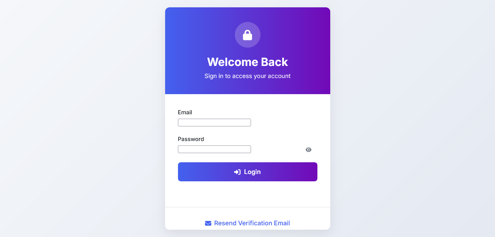
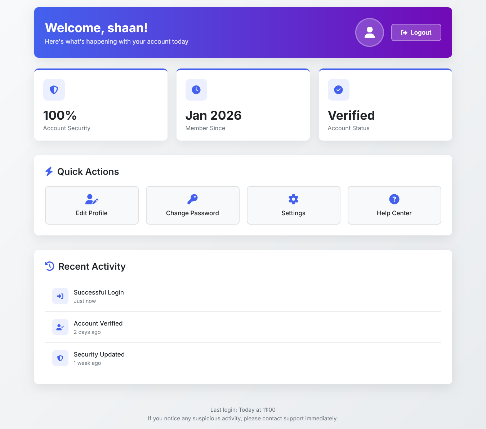
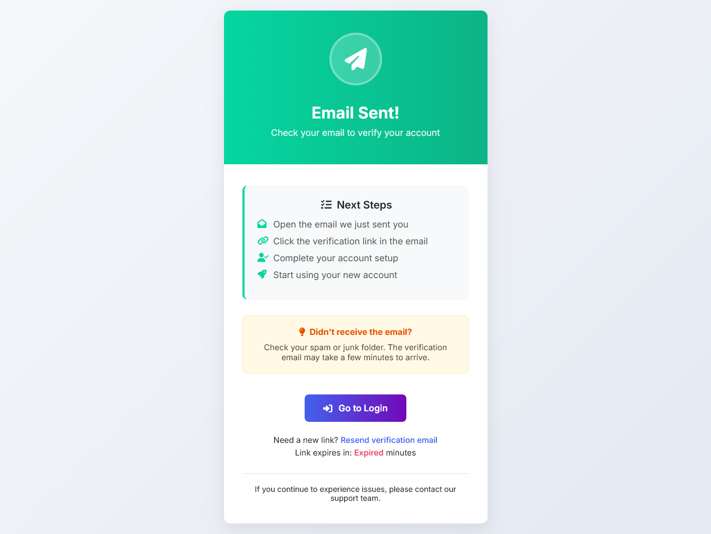
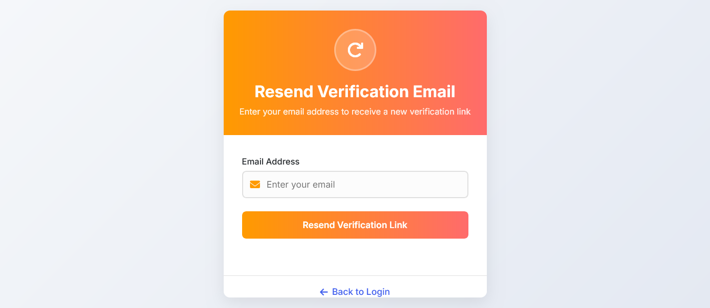
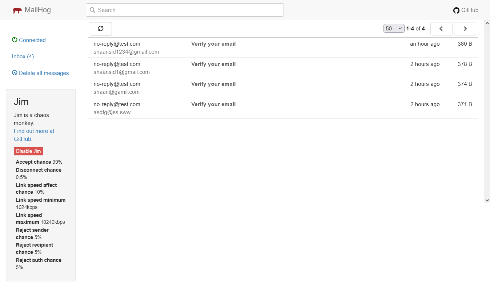
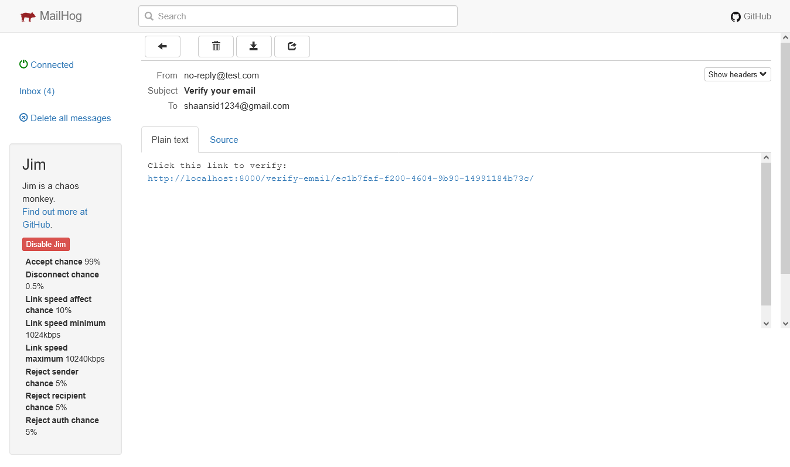

Email Verification System built with Django.
Features secure email-based signup, token verification, password setup, personal details onboarding, login/logout, resend verification, rate limiting, and session handling. Designed with real-world edge cases like expired sessions and inactive users in mind. Clean, scalable, and production-ready auth flow.

# Email Verification Project

This project demonstrates email verification workflow in Django.

## Screenshots

### Login Page

### Dashboard

### Email Sent Notification

### Resend Verification

### MailHog Capture

### Access Denied

