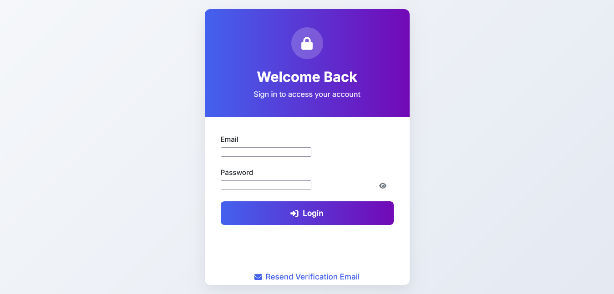
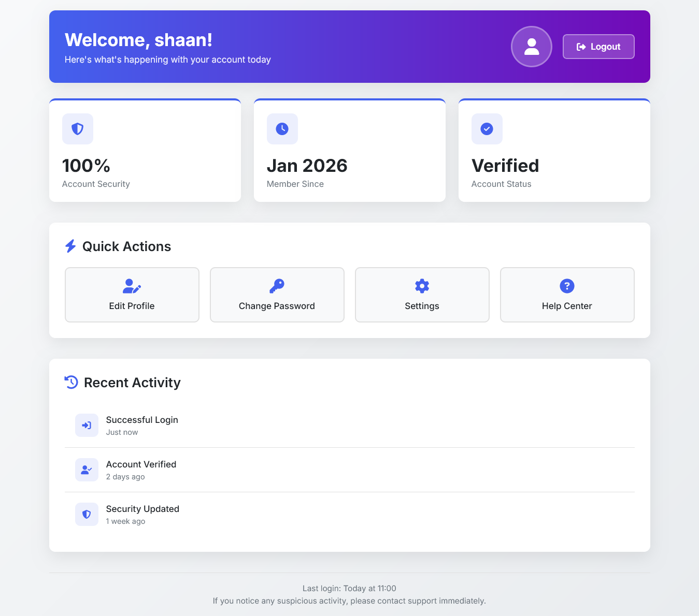
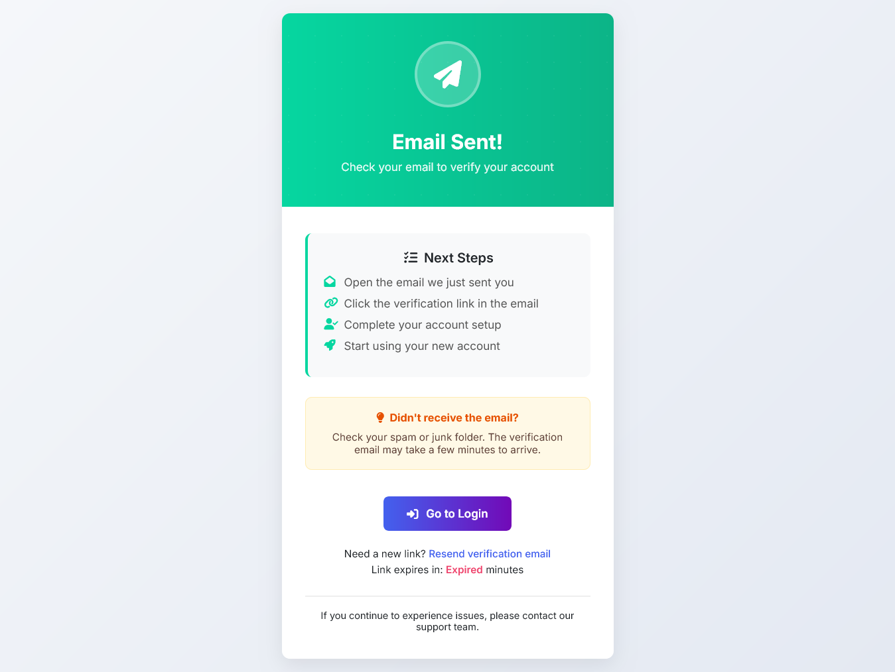
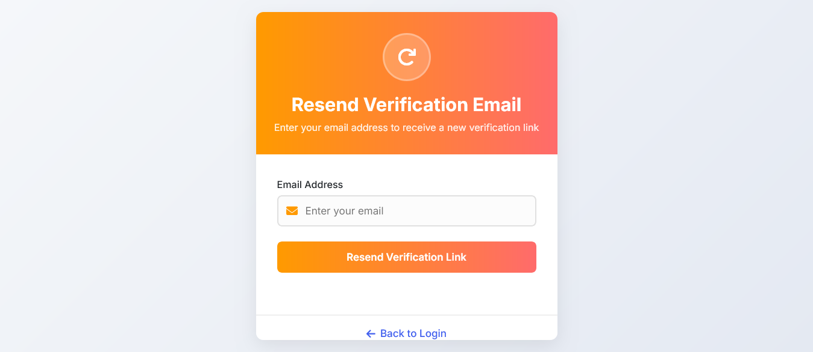
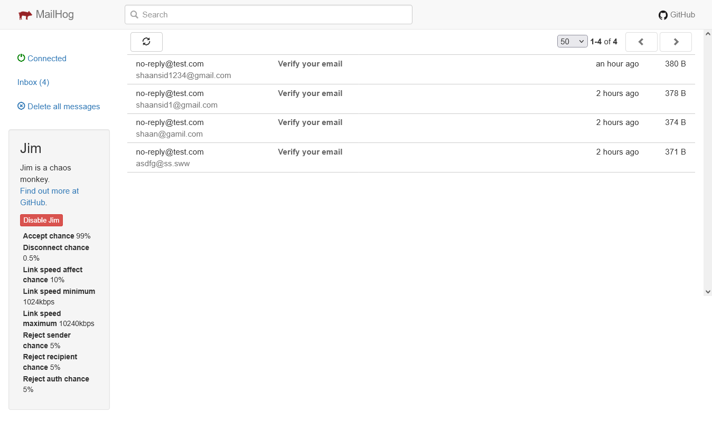
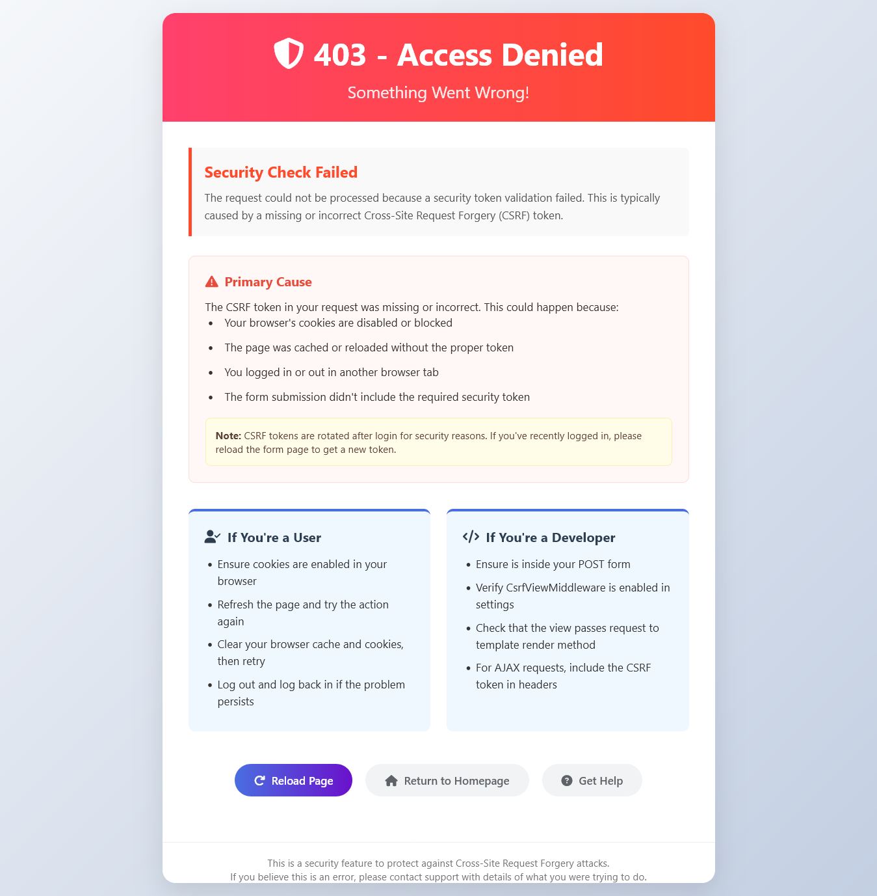

Markdown<div align="center">

  <h1>🛡️ Smart Login System Using Django</h1>

  <p>
    <strong>A secure, production-ready email-verified authentication system with smart multi-step onboarding, rate limiting, and clean UI.</strong>
  </p>

  <!-- Badges row -->
  <p>
    
    
    
    
    
    
  </p>

  <p>
    <a href="https://github.com/shaanMS/Smart_Login_System_Using_Django/stargazers">
      
    </a>
    <a href="https://github.com/shaanMS/Smart_Login_System_Using_Django/forks">
      
    </a>
    <a href="https://github.com/shaanMS/Smart_Login_System_Using_Django/issues">
      
    </a>
  </p>

  <br />

  
  <br><small><em>Modern dashboard after successful login & profile completion</em></small>

</div>

## ✨ Features

- 📧 **Multi-step Smart Signup Flow**  
  Email → Verification Link → Set Password → Complete Profile → Dashboard
- 🔐 **Secure Authentication**  
  - Email verification with unique UUID token  
  - Django’s built-in password hashing & auth  
  - Inactive user blocking until verified
- 🛡️ **Security Best Practices**  
  - Rate limiting on signup, login, verify & resend (django-ratelimit)  
  - Full CSRF protection  
  - HttpOnly session cookies  
  - XSS-safe templates
- 📬 **Email Integration**  
  SMTP backend (configurable for production)  
  Local testing support (e.g. MailHog / localhost:1025)
- 🧑‍💼 **Profile Management**  
  Auto profile creation via Django signals  
  Collects personal details (name, DOB, Aadhaar, address, etc.)
- 📊 **User Dashboard**  
  Shows verification status, join date, quick actions & logout
- 🔄 **Recovery Flows**  
  Resend verification email  
  Clean 403 forbidden / CSRF failure page
- 🎨 **Clean & Responsive UI**  
  Simple, mobile-friendly templates with form validation feedback

## 🖼️ Screenshots

<div align="center">
  <table>
    <tr>
      <td></td>
      <td></td>
    </tr>
    <tr>
      <td></td>
      <td></td>
    </tr>
    <tr>
      <td></td>
      <td></td>
    </tr>
    <tr>
      <td></td>
      <td></td>
    </tr>
  </table>
</div>

> *Tip: Place real screenshots in a `screenshots/` folder and update paths above.*

## 🚀 Tech Stack

- **Backend:** Django 5.2.5
- **Database:** SQLite (dev) – easily switch to PostgreSQL/MySQL
- **Email:** SMTP (localhost:1025 for testing)
- **Security:** django-ratelimit, CSRF middleware, HttpOnly cookies
- **Frontend:** HTML + CSS (Bootstrap-inspired styling)
- **Other:** Django signals, custom forms, UUID tokens

## ⚡ Quick Start

```bash
# 1. Clone the repo
git clone https://github.com/shaanMS/Smart_Login_System_Using_Django.git
cd Smart_Login_System_Using_Django

# 2. Create & activate virtual environment
python -m venv venv
source venv/bin/activate    # Linux / macOS
venv\Scripts\activate       # Windows

# 3. Install dependencies
pip install -r requirements.txt    # (create this file if missing)

# 4. Apply migrations
python manage.py migrate

# 5. (Optional) Create superuser
python manage.py createsuperuser

# 6. Run development server
python manage.py runserver

# 7. (For email testing) Run MailHog or similar in another terminal
#    http://localhost:8025 to view sent emails
Open → http://127.0.0.1:8000/
🛠️ Setup for Production (Important!)

Change SECRET_KEY (use environment variable!)
Set DEBUG = False
Configure real SMTP (Gmail, SendGrid, Amazon SES…)
Add ALLOWED_HOSTS
Enable HTTPS → uncomment SECURE_* settings
Use PostgreSQL instead of SQLite
Consider Celery + Redis for async email sending

📜 License
This project is licensed under the MIT License – see the LICENSE file for details.
💡 Why this project?
Great for:

Understanding Django custom authentication flows
Learning email verification patterns
Practicing security middlewares & rate limiting
Preparing for interviews (auth, forms, signals, security)

Feel free to ⭐ the repo if you find it useful!


# Email Verification Project Screenshots

### Login Page


### Dashboard


### Email Sent Confirmation


### Resend Verification


### Mail Preview


### Access Denied Page

